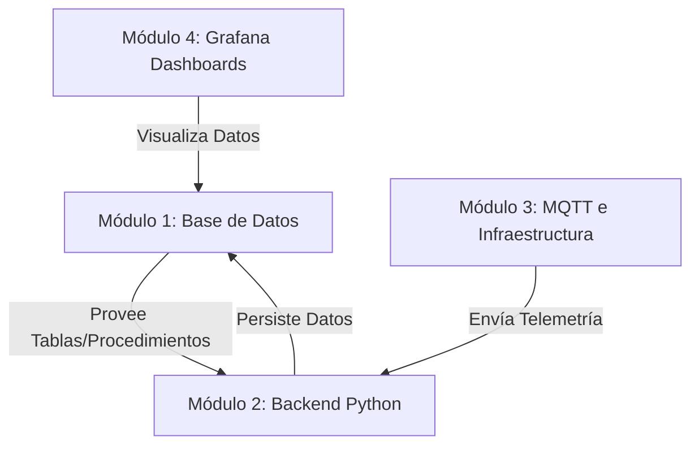

# Coordinación de Subagentes: Proyecto MES-OEE

Este directorio contiene la documentación y las guías de tareas preparadas para dividir el desarrollo del proyecto entre diferentes subagentes en conversaciones independientes.

## Módulos del Proyecto

## Guía de Archivos de Tareas

Puedes copiar e iniciar una nueva conversación con un agente utilizando los siguientes archivos como contexto/instrucciones iniciales:

1. **[1_database_agent.md](./1_database_agent.md)**: Para tareas relacionadas con SQL Server, tablas, histórico y turnos/calendario.
2. **[2_backend_agent.md](./2_backend_agent.md)**: Para tareas sobre procesamiento de OEE en Python, scripts MQTT, lógica de negocio e integración del chatbot Gemini.
3. **[3_grafana_agent.md](./3_grafana_agent.md)**: Para el diseño de dashboards, variables dinámicas en Grafana y actualizaciones de aprovisionamiento.
4. **[4_infrastructure_agent.md](./4_infrastructure_agent.md)**: Para la configuración de Docker Compose, red interna, puertos y MQTT Broker (Mosquitto).
